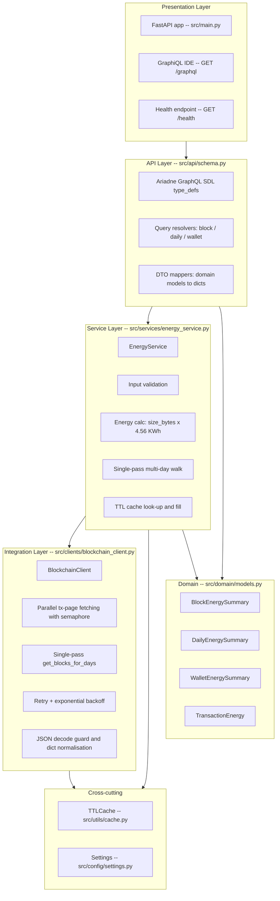
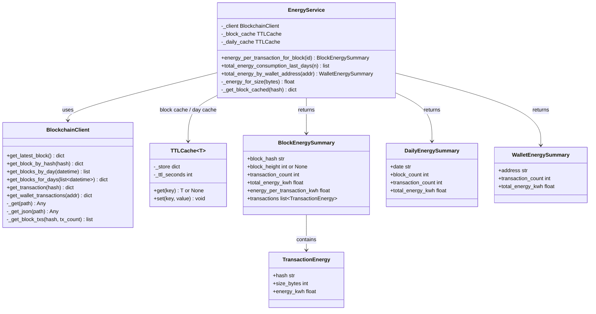
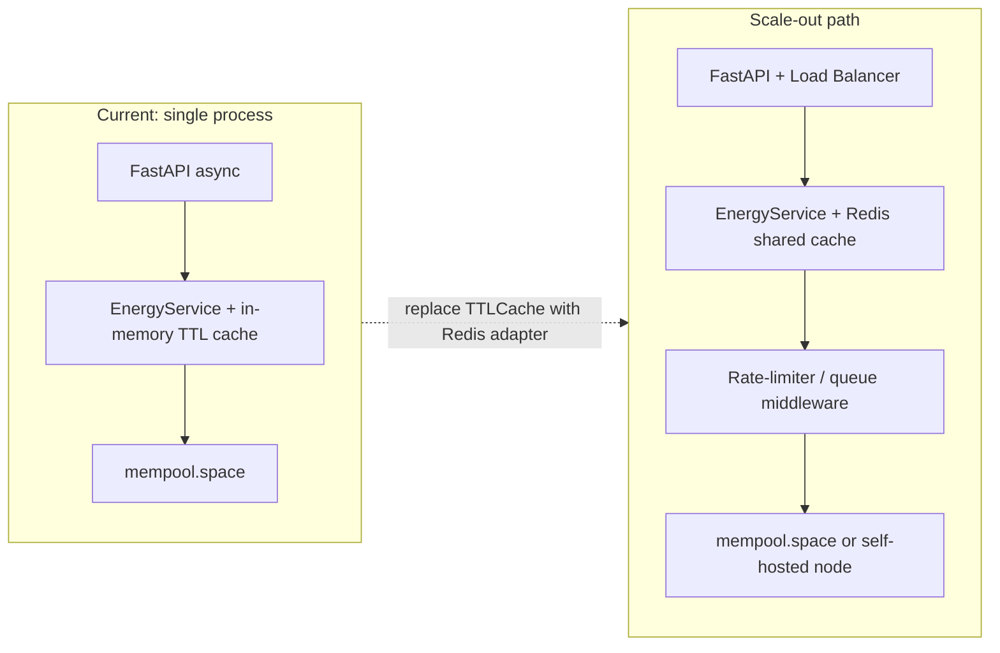

# Architecture

## Layer diagram



---

## Class relationships



---

## OOP principles applied

| Principle | Where |
|---|---|
| Single Responsibility | `BlockchainClient` owns all HTTP I/O; `EnergyService` owns all business logic and validation |
| Open/Closed | Swap data sources by replacing `BlockchainClient` (e.g. from mempool.space to a different provider); `EnergyService` never changes |
| Dependency Inversion | `EnergyService` receives a `BlockchainClient` instance via constructor injection; testable with a fake/stub |
| Encapsulation | Cache state is private (`_block_cache`, `_daily_cache`); only typed domain objects cross layer boundaries |
| Generic typing | `TTLCache[T]` is reused for blocks and daily summaries with full type safety |

---

## Key performance decisions

### 1. Parallel transaction-page fetching

The mempool.space API paginates block transactions in pages of 25. A modern
Bitcoin block (~2500 txs) requires 100 pages. Fetching them sequentially with a
pacing delay took ~60 s. All pages are now fetched concurrently under an
`asyncio.Semaphore(max_parallel_requests)`, reducing this to ~5–10 s.

```
Before:  page 0 → sleep → page 25 → sleep → ... (sequential, O(pages × latency))
After:   [page 0, page 25, page 50, ...] all concurrent, semaphore-bounded
```

### 2. Single-pass multi-day block walk

The daily energy query previously called `get_blocks_by_day` once per day, each
starting a fresh backwards walk from the chain tip:

```
days=3:  walk tip → day 0  (full walk)
         walk tip → day 1  (full walk again)
         walk tip → day 2  (full walk again)
         Total API calls ≈ 3 × (blocks_to_cover / 10) = O(N²)
```

The new `get_blocks_for_days` method does a **single walk**, partitioning blocks
into all requested day-buckets as it goes:

```
days=3:  walk tip → earliest day  (one walk)
         bucket blocks by UTC day as we go
         Total API calls ≈ blocks_to_cover / 10 = O(N)
```

This eliminates the timeout that occurred with `days > 1` on a cold cache.

---

## Scaling path


