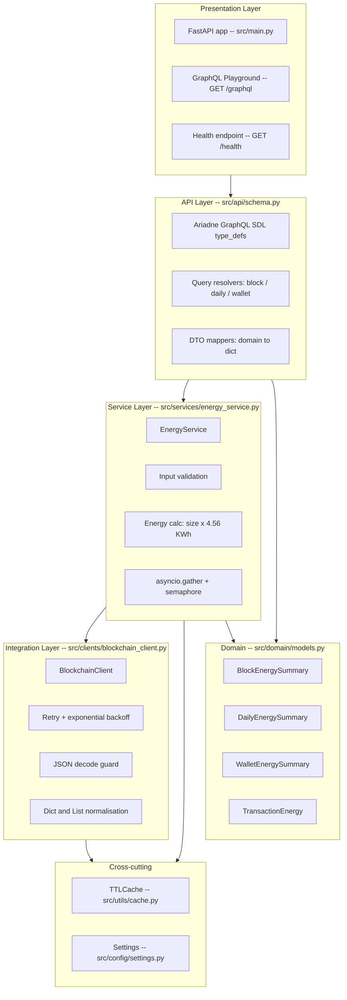
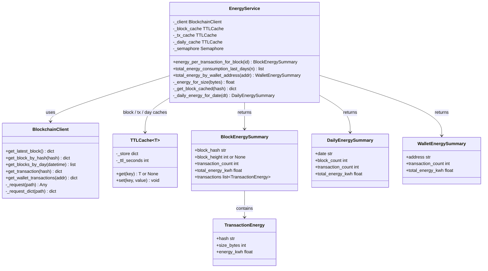
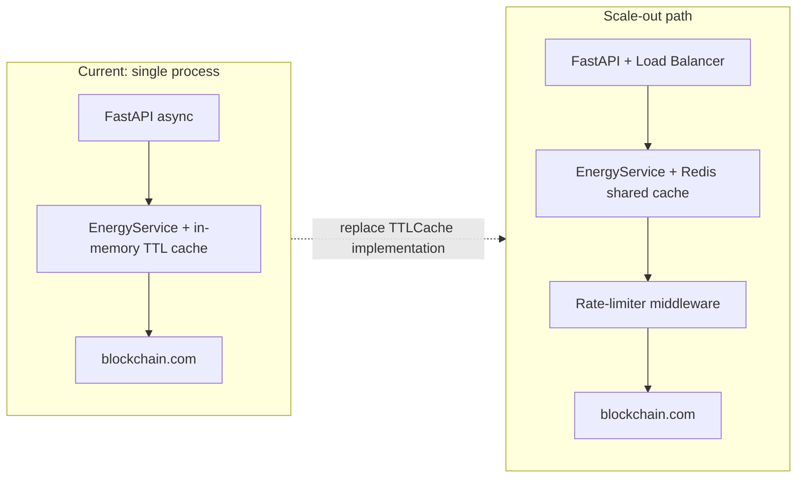

# Architecture

## Layer diagram

---

## Class relationships

---

## OOP principles applied

| Principle | Where |
|---|---|
| Single Responsibility | `BlockchainClient` owns HTTP; `EnergyService` owns business logic |
| Open/Closed | New data sources swap by replacing `BlockchainClient`; no service change needed |
| Dependency Inversion | `EnergyService` receives `BlockchainClient` via constructor |
| Encapsulation | Cache state is private; only typed domain objects cross layer boundaries |
| Generic typing | `TTLCache[T]` reused for blocks, transactions, and day summaries |

---

## Scaling path

