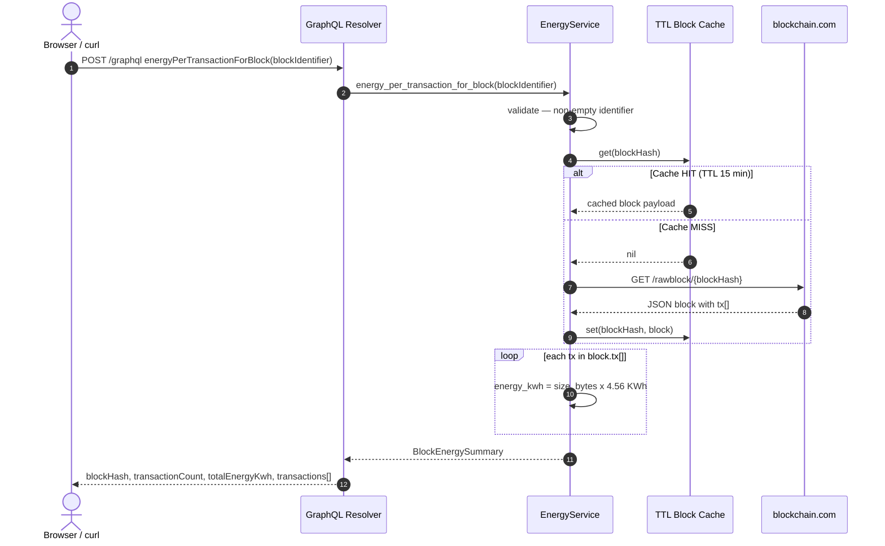
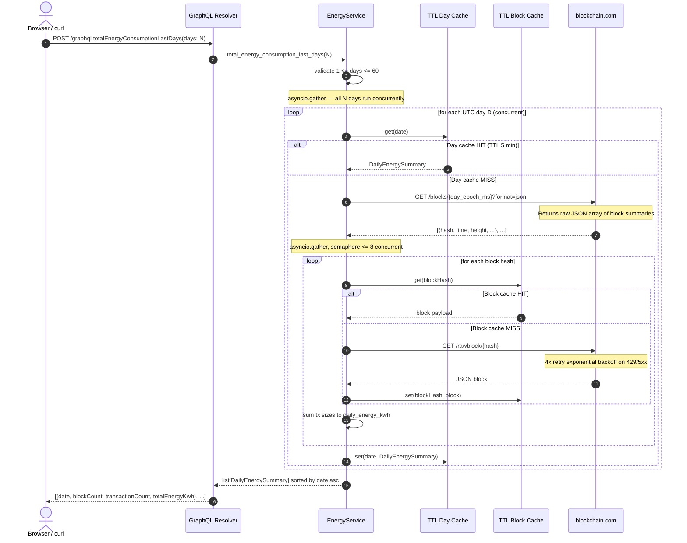
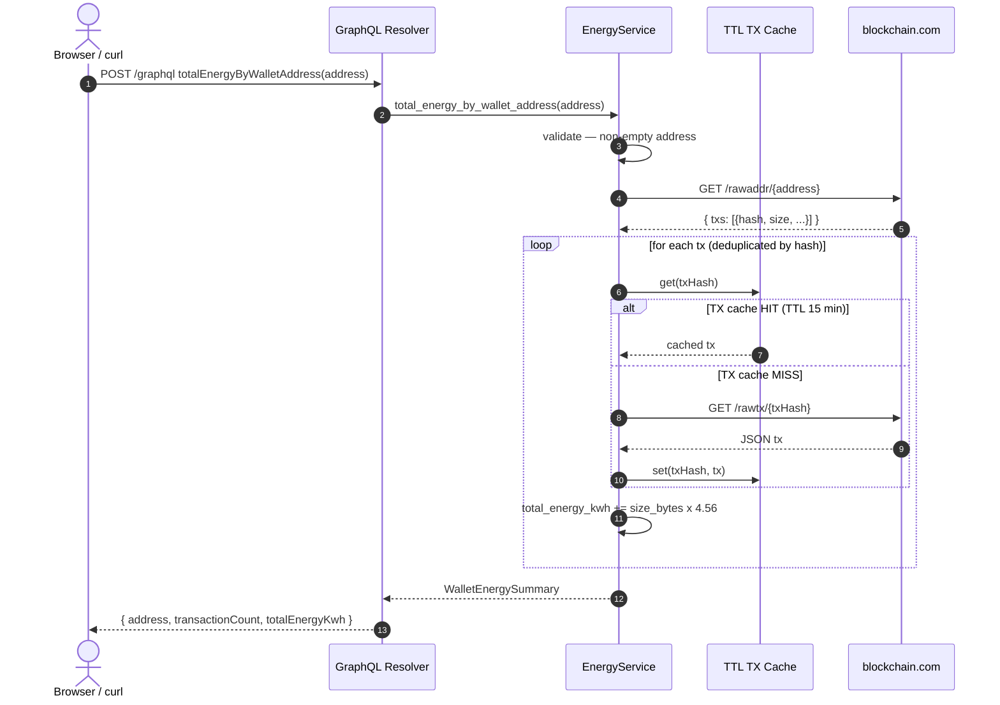

# Data Flow Diagrams

All diagrams render in GitHub, GitLab, and VS Code with the [Markdown Preview Mermaid Support](https://marketplace.visualstudio.com/items?itemName=bierner.markdown-mermaid) extension.

---

## 1 — `energyPerTransactionForBlock`



---

## 2 — `totalEnergyConsumptionLastDays`



---

## 3 — `totalEnergyByWalletAddress`



---

## 4 — Error handling flow

```mermaid
flowchart TD
    A([Incoming GraphQL request]) --> B{Input valid?}
    B -- No --> C[ValidationError in GraphQL errors[]]
    B -- Yes --> D[BlockchainClient._request]
    D --> E{HTTP response status}
    E -- 200 and valid JSON --> F{Payload type correct?}
    F -- Yes --> K([Return data to resolver])
    F -- No --> L[BlockchainClientError]
    E -- 200 but HTML body --> M[JSONDecodeError to BlockchainClientError]
    E -- 429 Rate Limit --> G[Sleep and retry max 4 attempts exponential backoff]
    G -- retry succeeds --> K
    G -- attempts exhausted --> H[BlockchainClientError in GraphQL errors[]]
    E -- 404 Not Found --> I[NotFoundError no retry immediate]
    E -- 5xx or network error --> G
    L --> G
    M --> G
```
