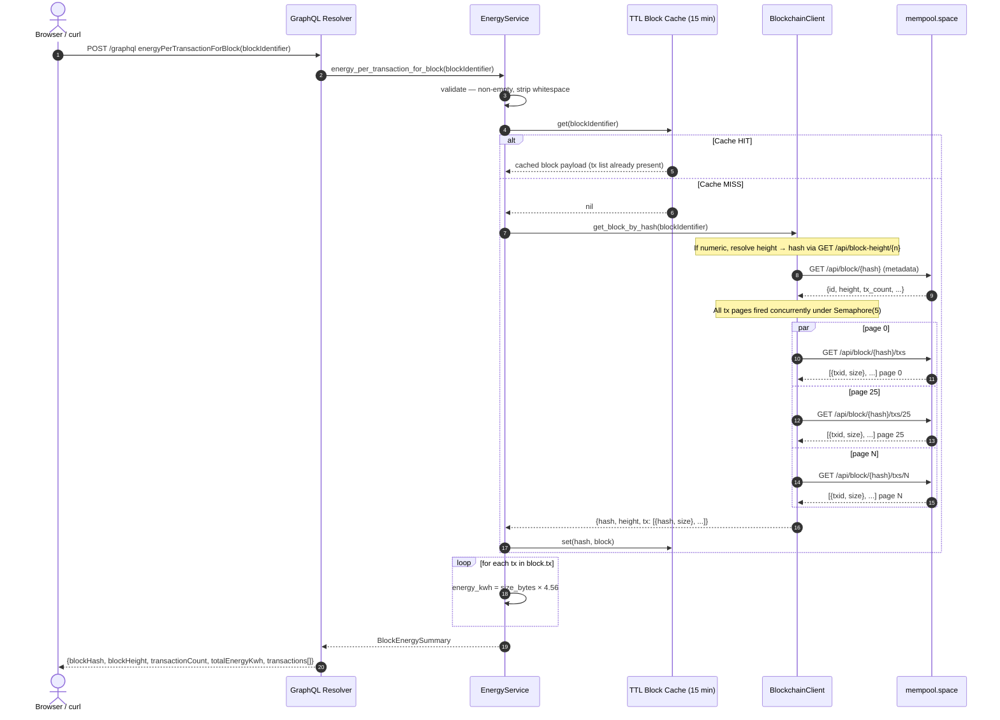
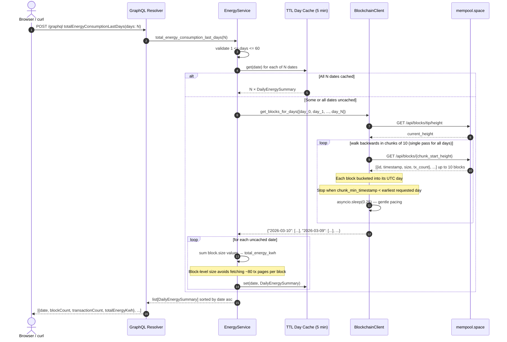
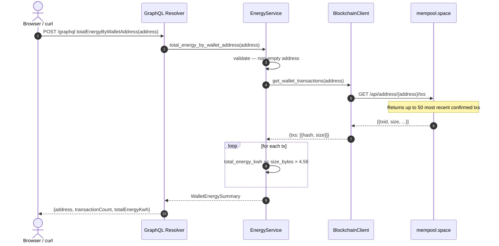

# Data Flow Diagrams

All diagrams render in GitHub, GitLab, and VS Code with the [Markdown Preview Mermaid Support](https://marketplace.visualstudio.com/items?itemName=bierner.markdown-mermaid) extension.

See `docs/images/` for screenshots of real query runs.

---

## 1 — `energyPerTransactionForBlock`

Transaction pages are fetched **concurrently** (bounded by `asyncio.Semaphore(5)`).
A cold-cache query for a modern block (~2500 transactions = 100 API pages) completes
in ~5–10 s instead of the ~60 s it took with sequential paging.



---

## 2 — `totalEnergyConsumptionLastDays`

All requested days are collected in a **single backwards walk** from the chain tip.
Previously N days required N separate walks (each starting from the tip), causing
O(N²) API calls and timeouts for `days > 1`.



---

## 3 — `totalEnergyByWalletAddress`



---

## 4 — Error and retry flow

Every outbound HTTP call in `BlockchainClient._get` follows this path:

```mermaid
flowchart TD
    A([Outbound GET request]) --> B{HTTP status}
    B -- 200 + JSON --> C{Payload shape expected?}
    C -- Yes --> K([Return to caller])
    C -- No / JSONDecodeError --> E
    B -- 429 Rate Limit --> R1[Sleep rate_limit_backoff_seconds\nstarts at 5 s, doubles each retry]
    B -- 404 Not Found --> NF[Raise NotFoundError\nno retry]
    B -- 5xx / network error --> E[Retry with exponential backoff\nstarts at 0.5 s, doubles each retry]
    R1 --> AT{Attempt <= max_retries?}
    E --> AT
    AT -- Yes --> A
    AT -- No / exhausted --> ERR[Raise BlockchainClientError\nGraphQL errors[] surface to client]
```

| Error type | Initial backoff | Max attempts |
|---|---|---|
| Network / 5xx | 0.5 s (doubles per retry) | 4 |
| HTTP 429 rate limit | 5.0 s (doubles per retry) | 4 |
| HTTP 404 | — | No retry |
