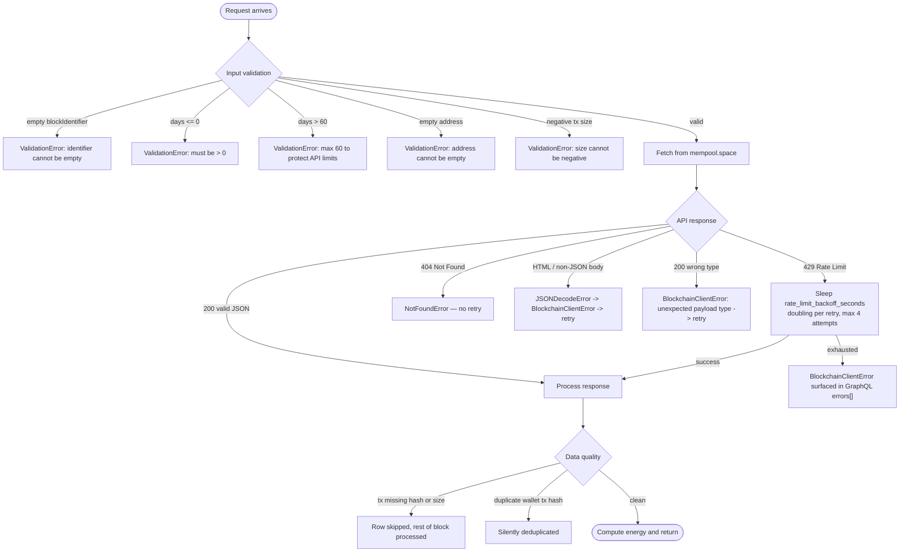

# Edge Cases

## Decision map

---

## Detailed breakdown

### Input validation guards

| Input | Rule | Error raised |
|---|---|---|
| `blockIdentifier` | Must be non-empty after `strip()` | `ValidationError` |
| `days` | `1 ≤ days ≤ 60` | `ValidationError` |
| `address` | Must be non-empty after `strip()` | `ValidationError` |
| Transaction `size` | Must be `>= 0` | `ValidationError` |

### Rate limiting — full handling strategy

Rate limiting was the main challenge for this API because both the block query
(many tx pages) and the daily query (many blocks) require large numbers of calls.
Four strategies are layered:

1. **`asyncio.Semaphore(max_parallel_requests)`** — all concurrent outbound calls
   from `_get_block_txs` share a semaphore (default 5). This prevents the burst
   of 100 simultaneous requests that would immediately trigger a 429.

2. **Differentiated exponential backoff** — `BlockchainClient._get` maintains two
   separate delays:
   - Regular errors (network / 5xx): start at 0.5 s, doubles each retry.
   - HTTP 429 rate-limit: start at 5.0 s, doubles each retry.
   This ensures the API has time to clear the limit window before we retry.

3. **Single-pass multi-day walk** — `get_blocks_for_days` issues only the minimum
   number of chunk requests needed to cover all requested days in one backwards
   walk, with a 0.25 s sleep between chunks. This replaces the previous approach
   of N separate full walks (one per day), which multiplied the call rate by N
   and reliably caused 429 cascades for `days > 1`.

4. **Block-level size aggregation** — the daily query uses the `size` field from
   the `/api/blocks/{height}` summary endpoint (included for free in every chunk)
   rather than fetching all transaction pages per block. This eliminates ~80
   additional API calls per block — the single largest contributor to rate limit
   errors in the original design.

### External API failures

| Scenario | Handling |
|---|---|
| 429 rate-limit | Exponential backoff retry starting at 5 s, up to 4 attempts |
| 404 not found | Immediate `NotFoundError`, no retry |
| 5xx server error | Exponential backoff retry starting at 0.5 s, up to 4 attempts |
| Network timeout / `httpx.HTTPError` | Same backoff as 5xx |
| HTML / non-JSON response body | `JSONDecodeError` → `BlockchainClientError` → retry |
| Unexpected dict/list type in response | `BlockchainClientError` with message |

### Data inconsistencies

| Scenario | Handling |
|---|---|
| Tx missing `hash` or `size` field | Row skipped silently; remaining transactions are still processed |
| Block with no transactions | Returns `transactionCount: 0, totalEnergyKwh: 0.0` |
| Numeric block identifier | Resolved to hash via `GET /api/block-height/{n}` before any other call |

### Performance safeguards

| Mechanism | Setting | Benefit |
|---|---|---|
| `asyncio.Semaphore` | `max_parallel_requests = 5` | Caps concurrent outbound calls; prevents 429 bursts |
| Parallel tx pages | `asyncio.gather` over all page offsets | Block query drops from ~60 s to ~5–10 s |
| Single-pass day walk | `get_blocks_for_days` | Daily query scales O(N) instead of O(N²) in requested days |
| TTL block cache | 15 min | Repeated block queries return instantly |
| TTL daily cache | 5 min | Second call within a session costs nothing |
| Chunk pacing | `asyncio.sleep(0.25)` between block chunks | Gentle on the API during day walks |
| `days ≤ 60` guard | Hard coded max | Prevents unbounded API fan-out |
