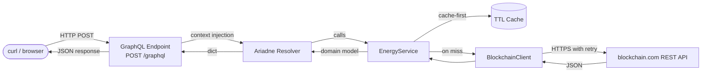
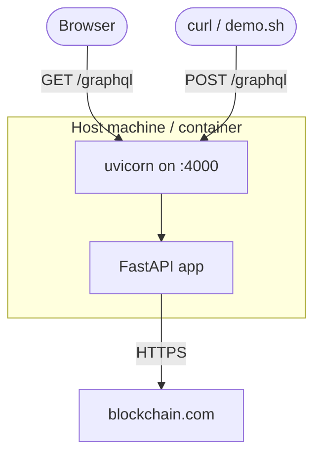

# System Architecture

## Request lifecycle

---

## Deployment view

---

## Runtime characteristics

| Property | Detail |
|---|---|
| Async I/O | All HTTP calls are `await`-based; no threads blocked |
| Bounded fan-out | `asyncio.Semaphore(8)` limits concurrent blockchain calls |
| Cache strategy | TTL cache per entity type (block 15 min, tx 15 min, day 5 min) |
| Retry policy | Up to 4 attempts with 0.5 s / 1 s / 2 s / 4 s backoff on 429 / 5xx |
| Error surface | All integration errors map to typed domain exceptions surfaced in GraphQL `errors[]` |

---

## Extensibility points

- **Cache**: swap `TTLCache` for a Redis adapter without touching `EnergyService`
- **Blockchain provider**: implement a new `BlockchainClient` subclass or replacement
- **New queries**: add resolver + SDL type; service logic stays isolated
- **Observability**: add structured logging / metrics middleware at the FastAPI layer
