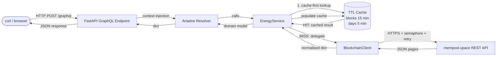
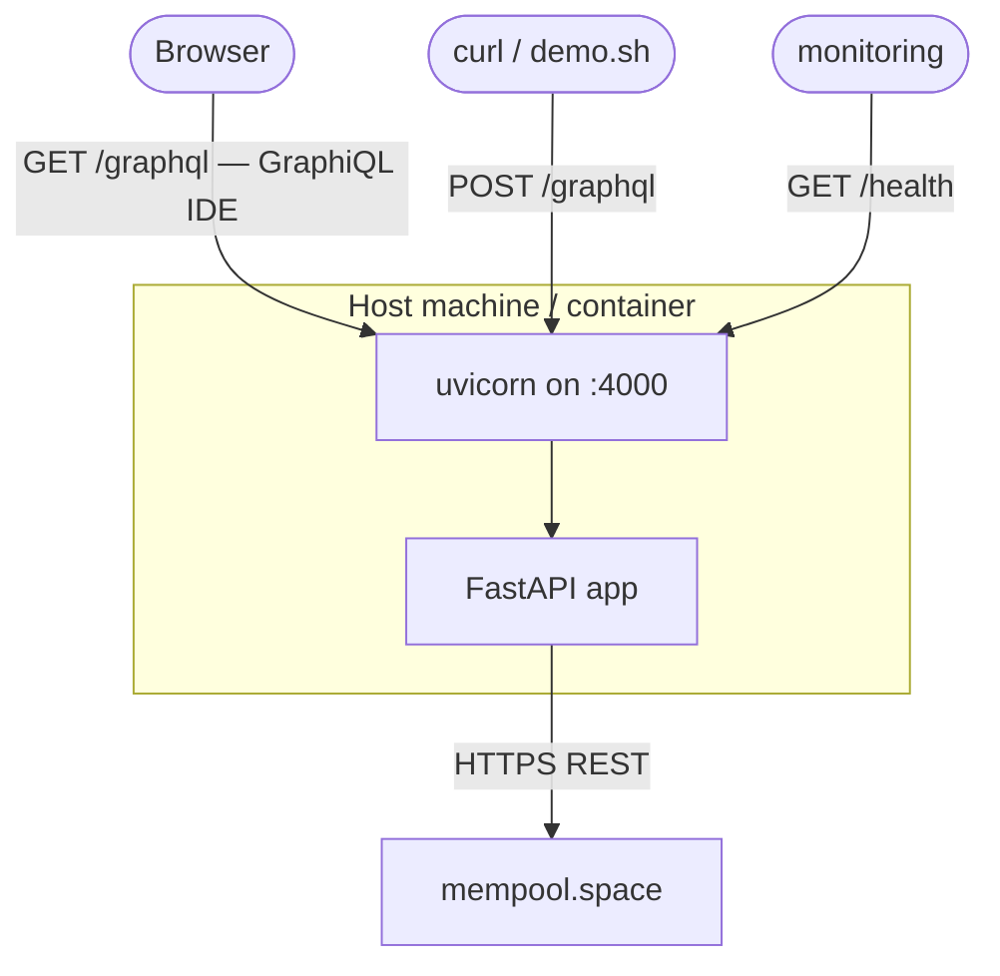

# System Architecture

## Request lifecycle

---

## Deployment view

---

## Runtime characteristics

| Property | Detail |
|---|---|
| Async I/O | All HTTP calls are `await`-based via `httpx.AsyncClient`; event loop never blocked |
| Bounded concurrency | `asyncio.Semaphore(5)` caps concurrent outbound requests in `_get_block_txs` |
| Parallel tx pages | `asyncio.gather` fires all transaction pages for a block concurrently — ~8× faster than sequential |
| Single-pass day walk | `get_blocks_for_days` collects all requested days in one backwards walk — O(N) vs old O(N²) |
| Cache strategy | Per-entity TTL cache (blocks 15 min, daily summaries 5 min); all cache hits are O(1) |
| Retry policy — regular | Up to 4 attempts, backoff 0.5 → 1 → 2 → 4 s on network / 5xx errors |
| Retry policy — rate limit | Up to 4 attempts, backoff 5 → 10 → 20 → 40 s on HTTP 429 |
| Error surface | All integration errors map to typed domain exceptions (`BlockchainClientError`, `NotFoundError`, `ValidationError`) surfaced in GraphQL `errors[]` |
| Block-level aggregation | Daily query uses block `size` field — avoids ~80 per-block tx-page fetches |

---

## Extensibility points

| What to change | How |
|---|---|
| **Cache backend** | Implement a Redis/Memcached adapter with the same `get/set` interface as `TTLCache`; inject into `EnergyService` constructor — zero service-layer changes |
| **Blockchain provider** | Write a new `BlockchainClient` against a different API (e.g. self-hosted Bitcoin node RPC); the service layer depends only on the public method contracts |
| **New GraphQL queries** | Add SDL type + Ariadne resolver in `src/api/schema.py`; add a method to `EnergyService`; the HTTP and cache layers are untouched |
| **Observability** | Add structured logging / Prometheus metrics as FastAPI middleware; no domain code changes needed |
| **Horizontal scaling** | Replace in-process `TTLCache` with a shared Redis cache; multiple app instances can then serve the same cached data |
